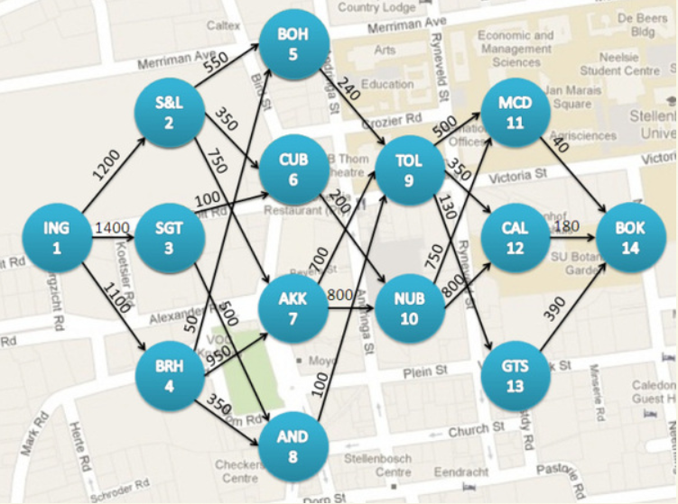
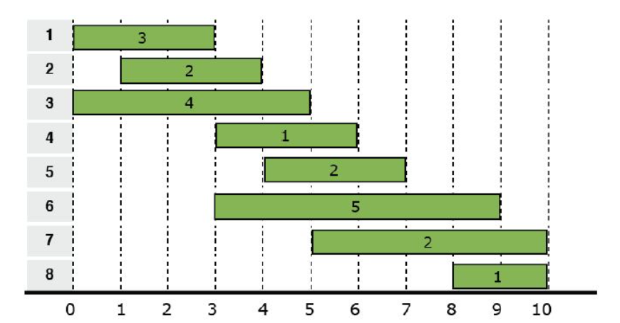
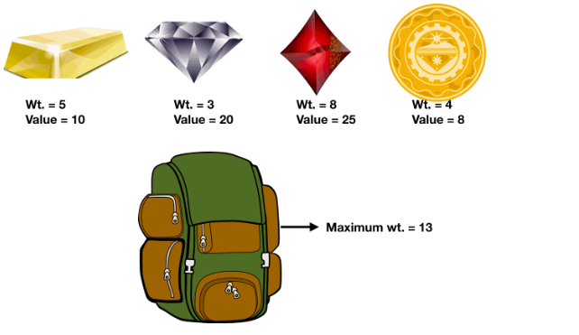

# Algorithms

## Introduction
An algorithm refers to an accurate and complete description of a solution, comprising a series of clear instructions for solving a problem. It represents the systematic method of describing the strategy mechanism for problem-solving. In other words, an algorithm can obtain the required output within a finite time for a given set of standardized inputs.

## Why are algorithms important

Algorithms provide effective methods for solving various problems. A superior algorithm can efficiently process large volumes of data in a short time, enhancing computational efficiency. When dealing with massive datasets or real-time computations, efficient algorithms can save time and resources. Moreover, the quality of algorithm design directly impacts the utilization of computational resources. Algorithms also exhibit scalability to address problems of different scales and complexities, while offering foundational support and theoretical guidance across various application domains.

## Greedy Algorithm

### Introduction
The greedy algorithm is a problem-solving strategy in which at each step, the algorithm makes the locally optimal choice without considering future consequences. In other words, the greedy algorithm aims to achieve the overall optimal solution by selecting the best possible option at each step.

### Advantages and Disadvantages

- Advantages: Greedy algorithms are simple to implement and understand, often exhibiting low time and space complexity. They can find optimal solutions for certain problems and are efficient, especially for large datasets.
- Disadvantages: However, their local optimization approach may fail to produce globally optimal solutions, particularly in complex problems. Greedy algorithms require careful analysis of problem characteristics, as they may not accurately solve problems without the greedy-choice property.

### Application
#### The shortest path problem

>
The shortest path problem refers to finding the shortest path between two vertices in a graph. It is commonly applied in real-life scenarios such as traffic planning and logistics management. To solve the shortest path problem, the Dijkstra algorithm is often employed.
(https://github.com/PeterWamg/Dijkstra)

#### Interval-Scheduling

>
Interval-Scheduling is a common scheduling problem used to organize a series of tasks or activities to maximize the utilization of resources. In the Interval-Scheduling problem, each task has a start time and an end time, and the objective is to select the maximum number of tasks such that their time intervals do not overlap with each other.
(https://github.com/PeterWamg/Interval-Scheduling)

#### Knapsack Problem

>
The Knapsack Problem is a classic optimization problem in computer science and combinatorial optimization. It's often encountered in resource allocation scenarios where items with different values and weights need to be packed into a knapsack with a limited capacity. The goal is to maximize the total value of the items packed into the knapsack without exceeding its weight capacity.
(https://github.com/PeterWamg/Knapsack)

(https://github.com/PeterWamg/Closest-Points)

